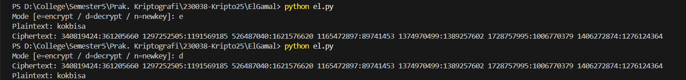

# Tugas 2: ElGamal 

Program ini dibuat untuk memenuhi tugas mata kuliah Kriptografi. Program dapat melakukan **enkripsi** dan **dekripsi** menggunakan skema **ElGamal** secara interaktif. Kunci dibuat otomatis dan disimpan ke file sehingga pemakaian harian cukup memasukkan plaintext atau ciphertext saja.

> File utama: `elgamal.py`  
> Kunci disimpan di: `public_key.json` dan `private_key.json`

## Ringkasan
- Skema: ElGamal pada aritmetika modulo p (bilangan prima besar).
- Parameter default: `p = 1_000_000_007` dan `g = 5`.
- Kunci:
  - Privat `x` acak.
  - Publik `y = g^x mod p`.
- Enkripsi per byte UTF-8. Tiap byte `b` dipetakan ke `m = b + 1` agar tidak nol.
- Tiap karakter memakai nilai acak `k` baru, sehingga ciphertext berbeda walau plaintext sama.

## Alur Program

### 1) Inisialisasi & Manajemen Kunci
- Saat program dijalankan, fungsi `ensure_keys()` mengecek apakah file `public_key.json` dan `private_key.json` ada.
- Jika belum ada:
  1. Set `p` dan `g` ke nilai default.
  2. Pilih `x` acak pada rentang `[1, p-2]`.
  3. Hitung `y = pow(g, x, p)`.
  4. Simpan `p, g, y` ke `public_key.json` dan `p, x` ke `private_key.json`.
- Mode `n` (newkey) akan membuat ulang `x` dan `y` dengan `p, g` tetap sama.

### 2) Enkripsi (mode `e`)
Untuk setiap karakter pada plaintext:
1. Ambil byte UTF-8 `b`, lalu set `m = b + 1`.
2. Pilih `k` acak pada `[1, p-2]`.
3. Hitung:
   - `c1 = g^k mod p`
   - `s  = y^k mod p`
   - `c2 = (m * s) mod p`
4. Simpan pasangan sebagai string `"c1:c2"`.
5. Gabungkan semua pasangan dengan spasi → itu adalah **ciphertext**.

### 3) Dekripsi (mode `d`)
Untuk setiap pasangan `"c1:c2"` pada ciphertext:
1. Parse ke bilangan bulat `c1` dan `c2`. Validasi `c1 < p` dan `c2 < p`.
2. Hitung:
   - `s  = c1^x mod p`
   - `s⁻¹ = s^(p-2) mod p`  (karena `p` prima)
   - `m  = (c2 * s⁻¹) mod p`
   - `b  = m - 1`
3. Kumpulkan semua `b` lalu decode ke UTF-8 → **plaintext**.

### 4) Format I/O
- **Ciphertext**: deretan `"c1:c2"` dipisah spasi, satu pasang per karakter.
  - Contoh:  
    `341247482:178613245 674934929:416578713 755721165:355988298`
- **Kunci**:
  - `public_key.json`: `{"p": ..., "g": ..., "y": ...}`
  - `private_key.json`: `{"p": ..., "x": ...}`  (**rahasia**)

## Screenshot Running Program

Berikut adalah contoh saat program dijalankan untuk proses enkripsi dan dekripsi.

*Gambar di atas menunjukkan proses enkripsi plaintext "kokbisa".
