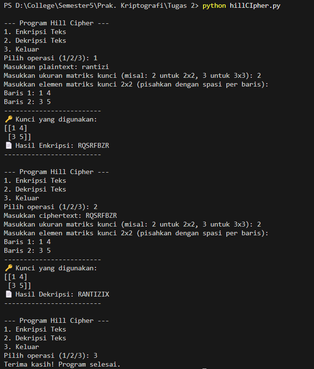

# Tugas 1: Hill Cipher

Program ini dibuat untuk memenuhi tugas mata kuliah Kriptografi. Program ini dapat melakukan enkripsi dan dekripsi menggunakan metode Hill Cipher secara interaktif.

## Penjelasan Alur Program

Program ini bekerja dengan alur sebagai berikut:

1.  **Tampilan Menu Utama**: Saat dijalankan, program akan menampilkan menu utama dengan 3 pilihan:
    * 1. Enkripsi Teks
    * 2. Dekripsi Teks
    * 3. Keluar

2.  **Input dari Pengguna**:
    * Jika memilih **Enkripsi**, program akan meminta pengguna memasukkan **Plaintext** (teks asli) dan **Matriks Kunci**.
    * Jika memilih **Dekripsi**, program akan meminta pengguna memasukkan **Ciphertext** (teks sandi) dan **Matriks Kunci** yang sama.

3.  **Proses Inti**:
    * **Enkripsi**: Program mengubah plaintext menjadi matriks angka, lalu mengalikannya dengan matriks kunci. Hasil perkalian di-modulo 26 untuk mendapatkan matriks ciphertext, yang kemudian diubah kembali menjadi teks.
    * **Dekripsi**: Program mencari **invers modular** dari matriks kunci. Kemudian, ciphertext diubah menjadi matriks angka dan dikalikan dengan matriks invers kunci tersebut. Hasilnya di-modulo 26 dan diubah kembali menjadi plaintext.

4.  **Validasi & Output**:
    * Program memiliki validasi untuk memastikan input matriks kunci valid dan bisa di-invers (untuk dekripsi).
    * Hasil enkripsi atau dekripsi akan ditampilkan dengan jelas di layar.

## Screenshot Running Program

Berikut adalah contoh saat program dijalankan untuk proses enkripsi.

*Gambar di atas menunjukkan proses enkripsi plaintext "CONTOH" dengan kunci matriks 2x2.*