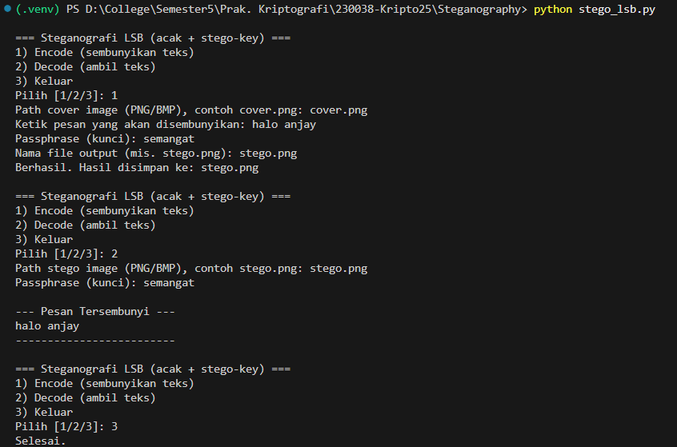

# Tugas 5: Steganography

Implementasi sederhana **steganografi LSB (Least Significant Bit)** berbasis Python. Proyek ini mendukung:

* **Encode**: sembunyikan teks rahasia ke dalam gambar (PNG/BMP) dengan urutan piksel **acak berbasis passphrase**.
* **Decode**: ekstrak kembali teks rahasia dari gambar dengan **passphrase** yang sama.
* **CLI interaktif**: menu 1) Encode 2) Decode 3) Keluar, cocok untuk demo praktikum.

> File utama: `stego_lsb.py` (satu file, siap jalan).
> Metode: **LSB 1-bit per kanal (R,G,B)** + **pengacakan posisi piksel** memakai seed dari SHA-256(passphrase).

---

## Fitur

* Menyisipkan pesan teks UTF-8 ke **PNG/BMP** (hindari JPEG karena lossy).
* **Kapasitas** kira-kira: `lebar × tinggi × 3 / 8` byte (1 bit/kanal).
* **Stego-key (passphrase)** mengacak urutan piksel, sehingga lokasi bit tidak berurutan.
* Validasi ukuran payload & deteksi kunci salah (panjang pesan tidak masuk akal).

---

## Instalasi

1. **Clone repo**

```bash
git clone https://github.com/yourname/steganography_lsb.git
cd steganography_lsb
```

2. **Buat virtual environment (disarankan)**

* Windows:

  ```powershell
  py -m venv .venv
  .\.venv\Scripts\activate
  ```
* macOS/Linux:

  ```bash
  python3 -m venv .venv
  source .venv/bin/activate
  ```

3. **Install dependensi**

```bash
pip install pillow
```

---

## Penggunaan (CLI Interaktif)

File utama: `stego_lsb.py`.

Jalankan:

```bash
python stego_lsb.py
```

Lalu pilih:

1. **Encode**

   * **Input**

     * `Path cover image`: mis. `cover.png` (gunakan PNG/BMP).
     * `Pesan`: teks yang ingin disembunyikan.
     * `Passphrase`: kunci untuk mengacak urutan piksel.
     * `Output`: mis. `stego.png`.
   * **Hasil**: file `stego.png` berisi pesan tersembunyi.

2. **Decode**

   * **Input**

     * `Path stego image`: mis. `stego.png`.
     * `Passphrase`: harus sama dengan saat encode.
   * **Hasil**: pesan tampil di terminal.

3. **Keluar**

   * Mengakhiri program.

> Contoh alur cepat:
>
> 1. Siapkan `cover.png` (mis. 800×600).
> 2. Encode → pesan: `Halo, ini rahasia.`, passphrase: `unpad-kriptografi`, output: `stego.png`.
> 3. Decode `stego.png` dengan passphrase yang sama → pesan tampil.

---

## Opsi Lanjutan (opsional)

Jika ingin dipakai sebagai **library** dari skrip lain, fungsi intinya dapat diekspor dari `stego_lsb.py`:

* `encode_lsb_keyed(cover_path, out_path, message, passphrase)`
* `decode_lsb_keyed(stego_path, passphrase) -> str`

Contoh:

```python
from stego_lsb import encode_lsb_keyed, decode_lsb_keyed
encode_lsb_keyed("cover.png", "stego.png", "pesan rahasia", "kata-sandi")
print(decode_lsb_keyed("stego.png", "kata-sandi"))
```

---

## Catatan & Keterbatasan

* **Format**: gunakan **PNG/BMP** (lossless). JPEG **tidak disarankan** karena kompresi lossy dapat merusak bit LSB.
* **Kapasitas**: walau bisa dinaikkan ke **m-bit LSB** (mis. 2 bit/kanal), kualitas visual akan menurun.
* **Keamanan**: ini **steganografi**, bukan enkripsi. Untuk kerahasiaan isi, **enkripsi pesan** terlebih dahulu (mis. AES) sebelum disisipkan.
* **Steganalisis**: teknik statistik/visual (chi-square, RS, enhanced LSB) bisa mendeteksi pola—gunakan cover yang cukup besar dan hindari payload terlalu besar.

---

## Struktur Proyek

```
steganography/
├─ stego_lsb.py         # CLI + fungsi encode/decode
├─ cover.png            # contoh cover (opsional)
├─ stego.png            # hasil encode (opsional)
└─ README.md
```

---

## Screenshot Running Program

Berikut adalah contoh saat program dijalankan untuk proses encode dan decode.



*Gambar di atas menunjukkan proses encode dan decode cover.png dengan embedded message = halo anjay dan stego-key = semangat.*

