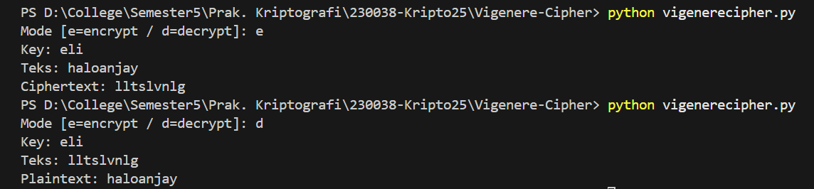

# Tugas 2: Vigenere Cipher

Program ini dibuat untuk memenuhi tugas mata kuliah Kriptografi. Program ini dapat melakukan enkripsi dan dekripsi menggunakan metode Vigenere Cipher secara interaktif.

## Ringkasan
Program ini melakukan enkripsi dan dekripsi teks menggunakan Vigenere Cipher.  
Huruf non-alfabet (spasi, tanda baca) dibiarkan apa adanya. Huruf besar/kecil dipertahankan.

## Alur Program
1. **Ambil key** dari input lalu normalisasi (huruf saja). Jika kosong, program menolak.
2. **Konversi key** menjadi deret pergeseran 0–25.
3. **Proses teks** karakter per karakter:
   - Jika huruf, geser sesuai key (mod 26). Untuk dekripsi, geser negatif.
   - Jika bukan huruf, langsung dilewatkan.
4. **Keluaran**: ciphertext (mode enkripsi) atau plaintext (mode dekripsi).

   > Flow singkat:
   > - Input: mode, key, teks  
   > - Validasi key → Buat deret shift → Geser tiap huruf → Cetak hasil

## Screenshot Running Program

Berikut adalah contoh saat program dijalankan untuk proses enkripsi dan dekripsi.

*Gambar di atas menunjukkan proses enkripsi plaintext "haloanjay".